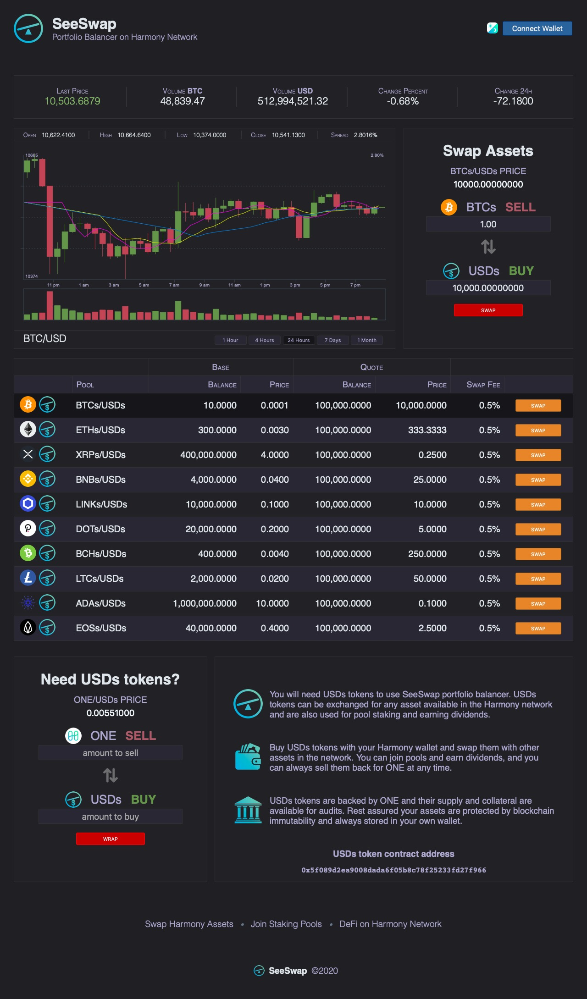

# SeeSwap
## Portfolio balancer and asset exchange

[https://seeswap.one](https://seeswap.one)




## How to use SeeSWAP Portfolio Balancer on Mainnet?

1. First install [Harmony One Wallet](http://harmony.one/onewallet) extension on your Chrome or Brave browser
2. Then create an account in mainnet and give it a name like 'Harmony Mainnet'
3. Add some funds to your account, there are no faucets so go to Binance and buy some ONEs
4. Check the list of tokens below and add to your wallet those you're going to use
5. To add tokens to your wallet, just copy/paste the address and hit 'Add'
6. Go to [SeeSWAP](https://seeswap.one/swap) web page and start swapping tokens
7. You will need USDs tokens to swap other assets, use the wrapper box to change ONE for USDs
8. Select the pool form the list of available pools and click the yellow 'Swap' button
9. Enter the amount to swap according to the current market prices
10. Hit the red 'Swap' button and wait 5 secs for the approval confirmation
11. Then wait another 5 secs for the transfer confirmation

That's it! Swapping Harmony tokens in less than ten seconds and less than one cent in fees!

## Tokens in Mainnet

```
• USDs  0x5f089d2ea9008dada6f05b8c78f25233fd27f966
• BTCs  0xea10a239c4fcaf31225efdb4dc634aeff42c585d
• ETHs  0x7334d832bfc79f59df8bc092cba3ae687faed7fa
• XRPs  0x33bA9Bf6cF19bCd91E2f745C0ac4c05A192c069F
• BCHs  0x4a6B66F5B955cA3FB51c59c272554Ee45bDb2239
• BNBs  0xbCf0038d69372773a966166d35Ac35B7B6914D33
• LINKs 0x62D8fEacf66E39Ed9179dB4f68581dBBa159457A
• DOTs  0x120aEeA98f391cBc7f1DCA79c5eDD8f329856258
• LTCs  0x10580fD9aB6DF1E836708C553165f1002D6ff2F9
• ADAs  0xDD697498B26F135C5C331022F17BA368A89489c1
• EOSs  0xf54f91a34C0280a8F3c11819a5364E4A67181ECe
```

## SeeSwap on Testnet is not available anymore

## ~~How to use SeeSWAP Portfolio Balancer on Testnet?~~

1. First install [Harmony One Wallet](http://harmony.one/onewallet) extension on your Chrome or Brave browser
2. Then create an account in testnet and give it a name like 'Harmony Testnet'
3. Add some funds to testnet account using Pops faucet at https://faucet.pops.one/
4. Request test tokens on Twitter by replying to @KuyawaK 'Send tokens'
5. Add the list of tokens to your wallet, just copy/paste the address and hit 'Add'
6. Go to [SeeSWAP](https://seeswap.one/swap) web page and start swapping tokens
7. Select the pool form the list of available pools and click the yellow 'Swap' button
8. Enter the amount to swap according to the current market prices
9. Hit the red 'Swap' button and wait 5 secs for the approval confirmation
10. Then wait another 5 secs for the transfer confirmation

That's it! Swapping Harmony tokens in less than ten seconds and less than one cent in fees!

## Tokens in Testnet

```
•  SEE 0x5B4596E8fC1C5e4817b65FFBb82522C8B29A8b52
• tONE 0xBcffe119ba1dCEdDB9BfeD1Ac21d475033c6F771
• tBTC 0x34c68Ac37eA92127C6A3FB4771560343305e7a80
• tETH 0x3d9ded6269271b0377530ba3c9d2ea1e310d204d
• tXRP 0xa96e42155009dfcebb89b9895826dba982e5f6f9
• tUSD 0xf0c4beb5ccd5e26aff44ed7dcbbfabc7c5334a3a
• tBNB 0x861df59a84bb817918bbf8e0a16ac377b6d6f873
• tLNK 0x910e5ad539b1ee5ef53efb6c9896f54830e926b6
• tDOT 0xb7d843692bf193f132ed09dca190e8c27fd8ef64
• tBCH 0x19be116818d23c361abd975636428e62b8cb106a
• tBSV 0x4513b520ed9f87217eed157107ca8f1b99df05bf
• tLTC 0x67474Bf0B65597F156ad66AAeaAdafC759b7447e
```